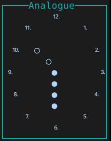

# ⏰  analogue.nvim

An analogue clock for neovim tui implemented purely in Lua.




## ✨ Features
- simple and minimal design
- 17 x 11 dimensional character box
- flexible position (floated window)
- clock refresh every ~3 minute
- configurable highlights and components (hands, dials) _soon_

## ⚡️ Requirements

- Neovim >= 0.9.4
- Compatible with Terminal UI (tui) environment

## 📦 Installation

Install the plugin with your preferred package manager:

### [packer.nvim](https://github.com/wbthomason/packer.nvim)

```lua
use "sinabyr/analogue.nvim"
```
#### Setup
```lua
-- plugin/analogue.lua
require("analogue").setup({
    -- override default options
})
```

## ⚙️ Configuration


Analogue comes with the following default configuration:

```lua
-- initializes the clock on startup
auto_start = true,

-- buffer default options
buf_opts = {
   buftype = 'nofile'
},

-- window default options
win_opts = {
   title = 'Analogue',
   title_pos = 'center',
   focusable = false,
   relative = 'editor',
   style = 'minimal',
   row = vim.o.lines - height,
   col = vim.o.columns - width,
   width = width,                -- height = 11
   height = height,              -- width = 16
   border = 'single'
}
```

## 🚀 Commands


Analogue comes with the following commands:

- `AnalogueOpen`: initialize and display the clock
- `AnalogueClose`: destroy the clock and clean up
- `AnalogueRefresh`: refresh the clock position to bottom-right corner _(complete_ _positions_ _soon)_
- `AnalogueHide`: hide the clock _(soon)_
- `AnaloguePosition [pos]`: set the clock position to `pos` _(soon)_

> 💡 if `auto_start` is set to false, then clock can be initialized with `AnalogueOpen` command


### API

_(Soon)_


## 🎨 Highlights

_(Soon)_

